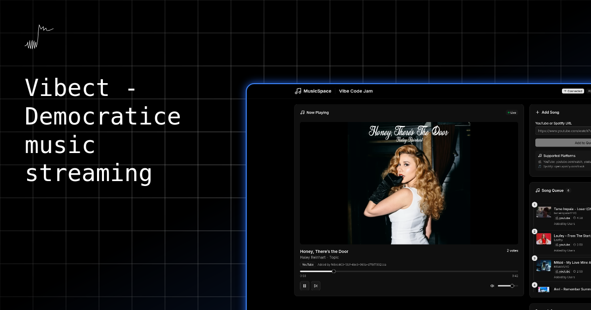

<div align="center">
  <a href="https://github.com/aunrxg/vibect">
    
    <h1>Vibect</h1>
    <p><strong>Democratic music streaming for everyone.</strong></p>
  </a>
  
  <p>
    <a href="#-about">About</a> •
    <a href="#-features">Features</a> •
    <a href="#-tech-stack">Tech Stack</a> •
    <a href="#-getting-started">Getting Started</a> •
    <a href="#-documentation">Documentation</a> •
    <a href="#-contributing">Contributing</a>
  </p>

  <p>
    <a href="https://github.com/aunrxg/vibect/stargazers">
      
    </a>
    <a href="https://github.com/aunrxg/vibect/blob/main/LICENSE">
      
    </a>
    <a href="https://github.com/aunrxg/vibect/releases">
      
    </a>
  </p>
</div>

<br />

---

## 🎵 About

Vibect is an open-source democratic music streaming platform where communities control what plays next through real-time voting. Create public or private spaces, add songs from YouTube, and let the crowd decide the soundtrack.

**Why Vibect?**
- 🗳️ **Democratic Voting** - Every listener has a voice in what plays next
- ⚡ **Real-time Sync** - Synchronized playback across all users using NTP-inspired time sync
- 🎭 **Public & Private Spaces** - Host open jam sessions or invite-only parties
- 🎼 **YouTube Integration** - Access millions of songs instantly
- 🏗️ **Production Ready** - Built with enterprise-grade architecture

---

## ✨ Features

### Core Functionality

- **Democratic Queue Management** - Songs automatically rank based on community votes
- **Real-time Playback Synchronization** - ±50ms accuracy across all clients using custom NTP protocol
- **Space Management** - Create unlimited public or private music spaces
- **YouTube Integration** - Add any song via simple YouTube links
- **Vote System** - Upvote/downvote songs with instant queue updates
- **Live Member Presence** - See who's listening in real-time

### Technical Highlights

- **Distributed Real-time Architecture** - WebSocket-based with Redis pub/sub for horizontal scaling
- **Custom NTP Time Sync** - Server-authoritative timing ensures perfect playback sync
- **Type-safe End-to-End** - Full TypeScript coverage from database to UI
- **Optimistic UI Updates** - Instant feedback with automatic rollback on errors
- **Production-grade Caching** - Redis-based caching layer for optimal performance
- **Rate Limiting & Security** - Protected against abuse with Fastify rate limiting

---

## 🏗️ Tech Stack

### Monorepo Architecture
- **[Turborepo](https://turbo.build/repo)** - High-performance build system
- **[pnpm](https://pnpm.io/)** - Fast, disk-efficient package manager

### Frontend (`apps/web`)
- **[Next.js 14](https://nextjs.org/)** - React framework with App Router
- **[TypeScript](https://www.typescriptlang.org/)** - Type safety
- **[Tailwind CSS](https://tailwindcss.com/)** - Utility-first styling
- **[shadcn/ui](https://ui.shadcn.com/)** - Beautiful, accessible components
- **[Socket.io Client](https://socket.io/)** - WebSocket communication

### Backend (`apps/api`)
- **[Fastify](https://fastify.dev/)** - High-performance web framework
- **[WebSocket (ws)](https://github.com/websockets/ws)** - Real-time bidirectional communication
- **[Prisma](https://www.prisma.io/)** - Next-generation ORM
- **[Redis](https://redis.io/)** - Caching and pub/sub messaging
- **[Supabase Auth](https://supabase.com/auth)** - Authentication provider

### Database & Infrastructure
- **[PostgreSQL](https://www.postgresql.org/)** - Primary database (via Supabase)
- **[Redis](https://redis.io/)** - Caching layer and pub/sub (via Upstash)
- **[Prisma](https://www.prisma.io/)** - Type-safe database client

### DevOps & Monitoring
- **[Docker](https://www.docker.com/)** - Containerization
- **[Vitest](https://vitest.dev/)** - Unit testing framework
- **[Pino](https://getpino.io/)** - High-performance logging

---

## 🏗️ Architecture

### System Design

```
┌──────────────────────────────────────────────────────────┐
│                    Client Devices                        │
│  ┌──────────┐  ┌──────────┐  ┌──────────┐  ┌──────────┐  │
│  │ Browser  │  │ Browser  │  │ Browser  │  │ Browser  │  │
│  │    1     │  │    2     │  │    3     │  │    N     │  │
│  └────┬─────┘  └────┬─────┘  └────┬─────┘  └────┬─────┘  │
│       │ WS          │ WS          │ WS          │ WS     │
└───────┼─────────────┼─────────────┼─────────────┼────────┘
        │             │             │             │
        └─────────────┴─────────────┴─────────────┘
                            │
              ┌─────────────▼──────────────┐
              │   WebSocket Server (4001)  │
              │   • Connection management  │
              │   • Event broadcasting     │
              │   • Time sync responses    │
              └─────────────┬──────────────┘
                            │
              ┌─────────────▼──────────────┐
              │   Redis Pub/Sub            │
              │   • Cross-server messaging │
              │   • State caching          │
              └─────────────┬──────────────┘
                            │
              ┌─────────────▼──────────────┐
              │  Fastify API Server (4000) │
              │   • Business logic         │
              │   • Vote aggregation       │
              │   • Queue management       │
              └─────────────┬──────────────┘
                            │
              ┌─────────────▼──────────────┐
              │   PostgreSQL Database      │
              │   • Spaces, Songs, Votes   │
              │   • User management        │
              └────────────────────────────┘
```

---

## 📁 Project Structure

```
vibect/
├── apps/
│   ├── web/                    # Next.js frontend
│   │   ├── src/
│   │   │   ├── app/           # App Router pages
│   │   │   ├── components/    # React components
│   │   │   ├── hooks/         # Custom hooks (WebSocket, etc.)
│   │   │   └── lib/           # Utilities
│   │   └── package.json
│   │
│   └── api/                    # Fastify backend
│       ├── src/
│       │   ├── config/        # Configuration & env validation
│       │   ├── plugins/       # Fastify plugins (Prisma, Redis, Auth)
│       │   ├── modules/       # Business logic (Spaces, Songs, Votes)
│       │   ├── websocket/     # WebSocket server & handlers
│       │   ├── middleware/    # Auth, rate limiting
│       │   └── lib/           # Utilities (NTP, Redis pub/sub)
│       └── package.json
│
├── packages/
│   ├── db/                     # Prisma schema & client
│   │   ├── prisma/
│   │   │   └── schema.prisma
│   │   └── index.ts
│   │
│   ├── types/                  # Shared TypeScript types
│   ├── typescript-config/      # Shared tsconfig
│   └── eslint-config/          # Shared ESLint config
│
├── turbo.json
├── pnpm-workspace.yaml
└── package.json
```

---

## 🚀 Getting Started

### Prerequisites

Ensure you have the following installed:
- **Node.js** >= 18.0.0
- **pnpm** >= 8.0.0
- **Git**

### 1. Clone the Repository

```bash
git clone https://github.com/aunrxg/vibect.git
cd vibect
```

### 2. Install Dependencies

```bash
pnpm install
```

### 3. Set Up Environment Variables

#### Create Supabase Project
1. Go to [supabase.com](https://supabase.com) and create a new project
2. Copy your database URL and auth keys

#### Create Upstash Redis
1. Go to [upstash.com](https://upstash.com) and create a new Redis database
2. Copy your Redis URL

#### Configure Environment Files

**`packages/db/.env`:**
```env
DATABASE_URL="postgresql://..."
DIRECT_URL="postgresql://..."
```

**`apps/api/.env`:**
```env
NODE_ENV=development
PORT=4000

# Database
DATABASE_URL="postgresql://..."

# Redis
REDIS_URL="redis://..."

# Supabase
SUPABASE_URL="https://xxx.supabase.co"
SUPABASE_ANON_KEY="your-anon-key"
SUPABASE_SERVICE_ROLE_KEY="your-service-role-key"

# CORS
CORS_ORIGIN="http://localhost:3000"
```

**`apps/web/.env.local`:**
```env
NEXT_PUBLIC_API_URL=http://localhost:4000/api
NEXT_PUBLIC_WS_URL=ws://localhost:4000/ws
NEXT_PUBLIC_SUPABASE_URL="https://xxx.supabase.co"
NEXT_PUBLIC_SUPABASE_ANON_KEY="your-anon-key"
```

### 4. Initialize Database

```bash
# Generate Prisma Client
cd packages/db
pnpm db:generate

# Push schema to database
pnpm db:push

# (Optional) Seed with sample data
pnpm db:seed
```

### 5. Start Development Servers

```bash
# From root directory
pnpm dev
```

This will start:
- 🌐 **Frontend**: http://localhost:3000
- 🔧 **API**: http://localhost:4000
- 🔌 **WebSocket**: ws://localhost:4000/ws

---

## 📖 Documentation

### Architecture Deep Dive

#### 1. NTP-Inspired Time Synchronization


The most technically impressive feature is the playback synchronization across all clients:

```typescript
// Client calculates server time offset
const offset = serverTimestamp - clientTimestamp - (roundTripTime / 2)
const serverTime = Date.now() + offset

// Calculate exact playback position
const position = (serverTime - startedAt) * playbackRate
```

**Accuracy**: ±50ms synchronization globally

**Read more**: [docs/architecture/ntp-sync.md](docs/architecture/ntp-sync.md)


#### 2. Distributed Vote Aggregation

Votes are processed through a carefully designed pipeline:

Votes flow through a carefully designed pipeline:
1. **Optimistic UI Update**: Client immediately reflects the vote
2. **Database Transaction**: Atomic upsert prevents race conditions
3. **Redis Pub/Sub**: Broadcasts vote to all connected servers
4. **WebSocket Broadcast**: All clients in the space receive the update
5. **Queue Recalculation**: Songs reordered based on new vote totals

**Read more**: [docs/architecture/voting-system.md](docs/architecture/voting-system.md)

#### 3. Horizontal Scaling with Redis

Redis pub/sub enables multiple WebSocket server instances:

```
┌─────────┐      ┌─────────┐      ┌─────────┐
│ Server1 │────▶│  Redis  │◀────│ Server2 │
└─────────┘      │ Pub/Sub │      └─────────┘
      │          └─────────┘           │
      ▼                                ▼
  [Clients]                        [Clients]
```

### API Documentation

Full API documentation with examples: [docs/api/README.md](docs/api/README.md)

**Quick Reference:**

```bash
# List public spaces
GET /api/spaces

# Create space (authenticated)
POST /api/spaces
Authorization: Bearer <token>
{
  "name": "Chill Vibes",
  "isPublic": true
}

# Add song to space
POST /api/songs
Authorization: Bearer <token>
{
  "spaceId": "...",
  "youtubeId": "dQw4w9WgXcQ",
  "title": "Never Gonna Give You Up"
}

# Vote on song
POST /api/votes
Authorization: Bearer <token>
{
  "songId": "...",
  "value": 1
}
```

### WebSocket Events

Connect to `ws://localhost:4000/ws`

**Client → Server:**
```json
{"type": "join_space", "data": {"spaceId": "..."}}
{"type": "time_sync", "data": {"clientTimestamp": 1234567890}}
```

**Server → Client:**
```json
{"type": "playback_updated", "data": {...}}
{"type": "queue_updated", "data": {...}}
{"type": "song_voted", "data": {...}}
```

---

## 🧪 Development

### Available Commands

```bash
# Development
pnpm dev              # Start all apps in dev mode
pnpm build            # Build all apps for production
pnpm lint             # Lint all packages
pnpm type-check       # Type check all packages
pnpm clean            # Clean all build artifacts

# Database (from packages/db)
pnpm db:generate      # Generate Prisma Client
pnpm db:migrate       # Create and apply migration
pnpm db:push          # Push schema (dev only)
pnpm db:studio        # Open Prisma Studio
pnpm db:seed          # Seed database

# Testing
pnpm test             # Run all tests
pnpm test:watch       # Watch mode
```

### Adding a New Feature

1. **Update Database Schema**: `packages/db/prisma/schema.prisma`
2. **Generate Client**: `pnpm --filter @vibect/db db:generate`
3. **Create Module**: `apps/api/src/modules/your-feature/`
4. **Add Routes**: Register in `apps/api/src/app.ts`
5. **Build UI**: Create components in `apps/web/src/components/`

### Code Quality

```bash
# Format code
pnpm format

# Lint
pnpm lint

# Type check
pnpm type-check
```

---

## 🚢 Deployment

>soon

---

## 📊 Performance Metrics

- **WebSocket Latency**: < 50ms (p95)
- **Time Sync Accuracy**: ±50ms across clients
- **Vote Processing**: < 100ms end-to-end
- **Queue Update**: Real-time (< 200ms)
- **Concurrent Users per Space**: Tested up to 100+

---

## 🤝 Contributing

We love contributions! Whether it's bug fixes, feature requests, or documentation improvements.

### How to Contribute

1. **Fork the repository**
2. **Create a feature branch**: `git checkout -b feature/amazing-feature`
3. **Make your changes**
4. **Run tests**: `pnpm test`
5. **Commit**: `git commit -m 'Add amazing feature'`
6. **Push**: `git push origin feature/amazing-feature`
7. **Open a Pull Request**

### Development Guidelines

- Follow the existing code style
- Write meaningful commit messages
- Add tests for new features
- Update documentation
- Ensure all tests pass

**Read more**: [CONTRIBUTING.md](CONTRIBUTING.md)

---

## Roadmap

- [x] User authentication with OAuth providers
- [x] Democratic voting system
- [x] Real-time WebSocket communication
- [x] NTP-based time synchronization
- [x] YouTube integration
- [x] Production-ready backend architecture
- [x] Mobile-responsive design improvements
- [ ] Public/private spaces
- [ ] Enhanced queue algorithms (time decay, fairness)
- [ ] Spotify integration
- [ ] Playlist creation and management
- [ ] Room themes and customization
- [ ] Advanced analytics dashboard
- [ ] Mobile apps (React Native)
- [ ] chat integration
- [ ] Moderation tools
- [ ] Public API for third-party integrations
- [ ] Song history and statistics
- [ ] User reputation system

Vote on features or suggest new ones in [Discussions](https://github.com/aunrxg/vibect/discussions)!

## 📝 License

Distributed under the MIT License. See [LICENSE](LICENSE) for more information.

---

## 💬 Community & Support

- 💬 **Discussions**: [GitHub Discussions](https://github.com/aunrxg/vibect/discussions)
- 🐛 **Bug Reports**: [GitHub Issues](https://github.com/aunrxg/vibect/issues)
- 🐦 **Twitter**: [@aunrxg](https://x.com/aunrxg)
- 📧 **Email**: anuragpoddar9484@gmail.com

---

## 🙏 Acknowledgments

Special thanks to these amazing open-source projects:

- [Cal.com](https://github.com/calcom/cal.com) - Inspiration for project structure
- [Fastify](https://fastify.dev/) - Lightning-fast web framework
- [Prisma](https://prisma.io/) - Next-generation ORM
- [Supabase](https://supabase.com/) - Open-source Firebase alternative
- [shadcn/ui](https://ui.shadcn.com/) - Beautiful component library
- [Turborepo](https://turbo.build/) - High-performance monorepo system

---

## 📧 Contact

Anurag Poddar - [@aunrxg](https://aunrxg.live) - anuragpoddar9484@gmail.com

Project Link: [https://github.com/aunrxg/vibect](https://github.com/aunrxg/vibect.git)

Live Demo: [https://music-space-theta.vercel.app](https://music-space-theta.vercel.app)

---

## ⭐ Star History

If you find this project useful, please consider giving it a star! It helps the project grow and reach more developers.

[](https://star-history.com/aunrxg/vibect&Date)

---

<div align="center">
  <strong>Built with ❤️ by the open-source community</strong>
  <br />
  <sub>Made possible by contributors around the world</sub>
</div>